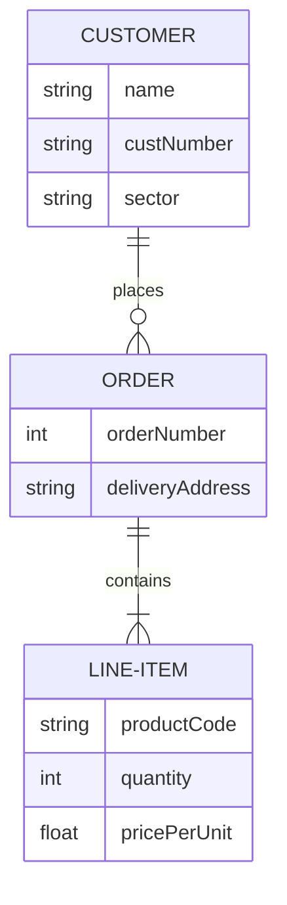

# OpenLoot-API

## TODO : 

Listings all items : https://listing-api.openloot.com/v2/market/listings?gameId=3af107fb-59f4-4859-b1f6-60a46b6a52bf&page=2&pageSize=100
listings currencies tradable : https://vault-api.openloot.com/v2/market/premium-currencies/b27b1f68-1be1-450e-b8da-987a1165d86f/stats
Sponsor Marks : b27b1f68-1be1-450e-b8da-987a1165d86f
Proxy-token : 98f71b5d-3be0-4a8c-ab8e-4cfa9282c97d

Listing Flex packs : https://vault-api.openloot.com/v2/market/premium-currencies/45883f75-bf13-42dc-8dab-eb6af8efa8b4/sales
ID (de 0 à 5) => price
ID (de 0 à 5) => product/amount
+
Listing Flex specil offers : https://vault-api.openloot.com/v2/market/premium-currencies/45883f75-bf13-42dc-8dab-eb6af8efa8b4/special-offers
ID => price
ID => product/amount 
Tags BF : https://vault-api.openloot.com/v2/market/games/3af107fb-59f4-4859-b1f6-60a46b6a52bf 

## Required

## Nice to have 

